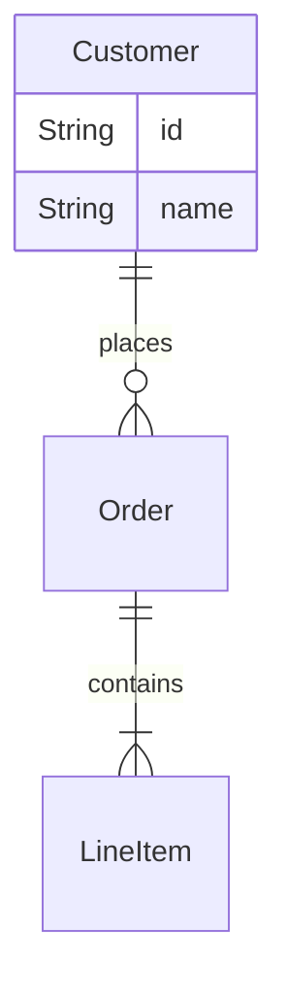

# General
- types of diagram
    - `flowchart`
    - `classDiagram` [UML]: focus more on what each class can do. Typically used to show the structure of program.
    - `erDiagram`: focus more on relationship between concepts, less on what each concept can do. Typically used to show the structure of database
    - `sequenceDiagram` [UML]: for multiple participants interaction sequence such as Client and Server

- Shared syntax
    - `%%`: comments

# Mermaid flowchart template
- Nodes
    - `[]`: facts?
    - `()`: action point
    - `{}`: decision point
- Relationships
    - `-->`: directed arrow
    - `||`: annotation on link

```mermaid

flowchart LR
    s[Start] --> email(Enter your email)
    email --> user{Existing User?}
    user -->|no| name(Enter name)
    user -->|yes| link(Send email with magic link)
    name --> condition{Except condition?}
    condition --> |no| email
    condition --> |yes| link
    link --> e[End]
 ```

# Class diagram template
- Attribute symbol
    - `<<>>`: notation usually used to declare <<abstract>>
    - `+`: public
    - `#`: protected
    - `-`: private
- Relationships
    - `-->`: directed association
    - `--`: association
    - `--|>`: inheritance
    - `o--`: aggregation
    - `*--`: Composition


```mermaid
classDiagram
    class Champion{
        <<abstract>>
        +Int HP
        +Int Mana/Energy
        +q()
        +w()
        +e()
        +r()
    }
    class Summonor{
        + d()
        + f()
    }
    class Yasuo{
        +q()
        +w()
        +e()
        +r()
    }
    class Fizz{
        +q()
        +w()
        +e()
        +r()
    }
    class Match{
        +List Champions
    }
    %% enumeration
    class Status{
        <<enumeration>>
        DEAD
        ALIVE
    }
    Champion <|-- Yasuo
    Champion <|-- Fizz
    Match *--o Champion %% campaign cannot spawn without a match game but a match can be created without having any campaign

```


# erDiagram
- Relationships
    - `|o`, `o|`: zero or 1
    - `||`, `||`: exactly one
    - `}o`, `o{`: zero or more
    - `}|`, `|{`: one or more


